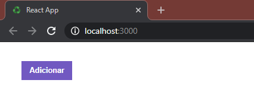
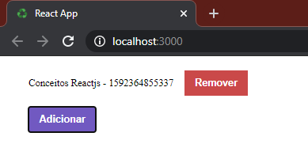
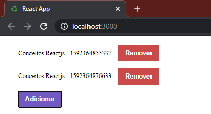
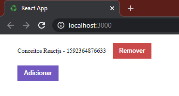

    

    
    
    
    
    
    
    
    
    

  <a href="#-Sobre-o-desafio">🚀 Sobre o desafio</a>&nbsp;&nbsp;&nbsp;|&nbsp;&nbsp;&nbsp;
  <a href="#-Projeto">🚧 Projeto</a>

# 🚀 Sobre o desafio

Nesse desafio, você deve criar uma aplicação para treinar o que você aprendeu até agora no ReactJS!

Agora você deve continuar desenvolvendo a aplicação que irá armazenar repositórios do seu portfólio, que você já desenvolveu o backend no último desafio utilizando o Node.js.

# 🚧 Projeto 

    
Utilizando o próprio browser para ter uma resposta visual:  
    🟣 Inicialmente é feita uma requisição GET á API, como não ha dados na API a lista fica vazia. 
    🟣 É realizada apenas uma vez a requisição GET, com isso os dados são salvos local com o uso do hook useState.

    
    
🟢 Após adicionar o objeto á API com método POST, é renderizado o título do primeiro objeto. 🟢 E para a renderização não é feita uma nova requisição GET á API.

    
    
🟢 Novamente é adicionado outro objeto a API com método POST e renderizado o título dos dois objeto.  🟢 E novamente não é feita uma nova requisição GET para lsitar os dados.

    
    
🔴 Aqui foi clicado no botão remover do primeiro objeto realizando o método DELETE, também não houve uma renderização pois os dados estão salvos local com o uso do hook useState.

    

---

Desenvolvido com 💚 por [Felipe Zanetti!](https://www.linkedin.com/in/felipezanetti/)